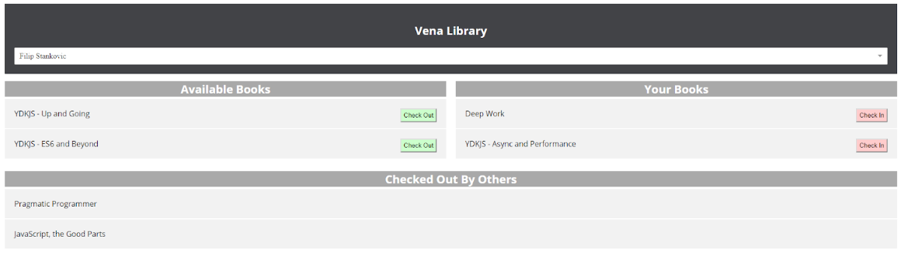

# react-redux-workshop

### Motivation

This is a simple application to manage our product library allowing users to check out and check in books. Learn React and Redux by coding along as we add functionality. The goal is to fully setup your dev environment with React related tooling and familiarize yourself with how data flows through the application.

Accompanying slides & background - https://docs.google.com/presentation/d/1EqyvDZCd9dfrkhUk5D5mq1bPyx2eWXnxi2hBdpGjXAs/edit?usp=sharing

### Installation

Prerequisites: Node 8.x

0.  Clone the project

`git clone git@github.com:boweihan/react-redux-workshop.git`

1.  Install dependencies

`npm install`

2.  Run the json api server

`npm run server`

3.  Run the Webpack dev server

`npm start`

### Development Tools

React and Redux devtools are useful for development. These particular links are for the Chrome extensions but they are available in any popular browser and as a standalone application.

React Developer Tools - https://chrome.google.com/webstore/detail/react-developer-tools/fmkadmapgofadopljbjfkapdkoienihi

Redux Devtools - https://chrome.google.com/webstore/detail/redux-devtools/lmhkpmbekcpmknklioeibfkpmmfibljd?hl=en

### Project Structure

Components - `src/components` 
Action Creators - `src/actions` 
Reducers - `src/reducers` 
DB file - `server/db.json` 

### Workshop Structure

1.  React/Redux overview
2.  Project overview
3.  Checkout functionality code-along exercise
4.  Checkin functionality pair programming exercise

### Bonus Challenges

1.  Display user names for checked out books
2.  Add checkout time information and due dates
3.  Implement validation so that a user can only check out one book at a time
4.  Implement loading UI for asynchronous requests
5.  Fully normalize the redux store
6.  Implement middleware that catches errors in the redux flow and log. Implement middleware that catches errors in the redux flow and logs them to console

### Notes

This project was bootstrapped with create-react-app.
